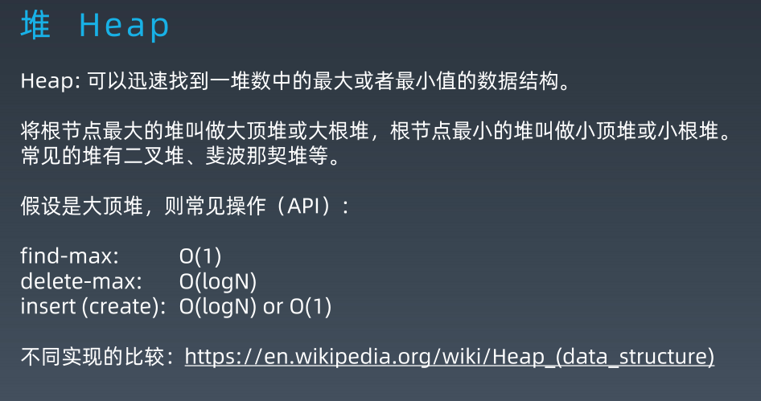
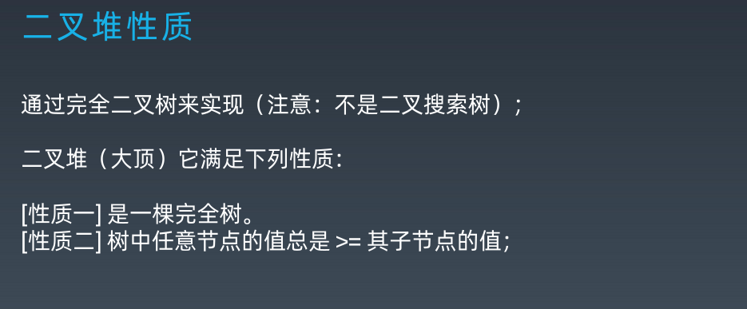
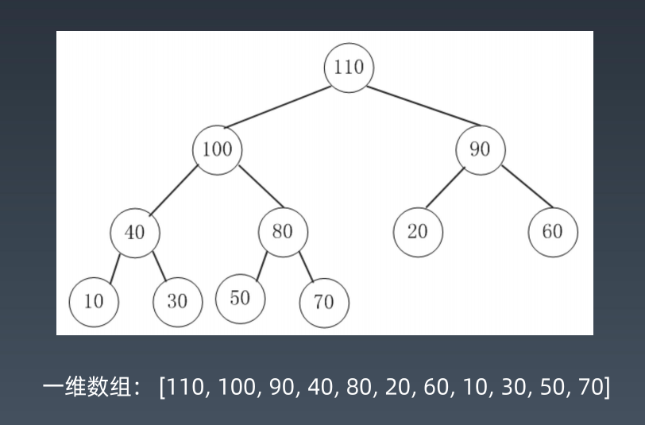
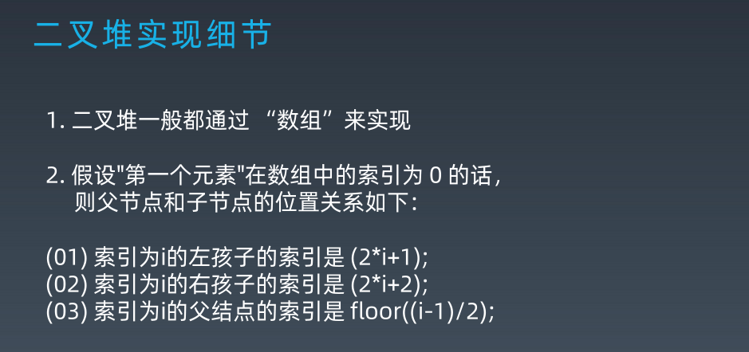
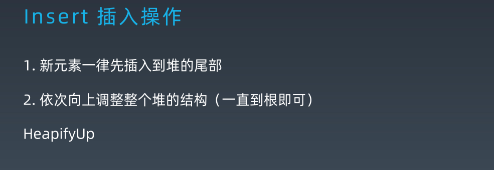
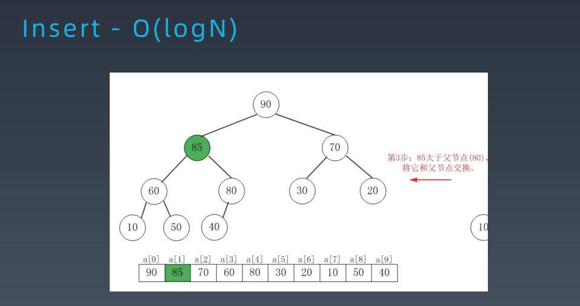
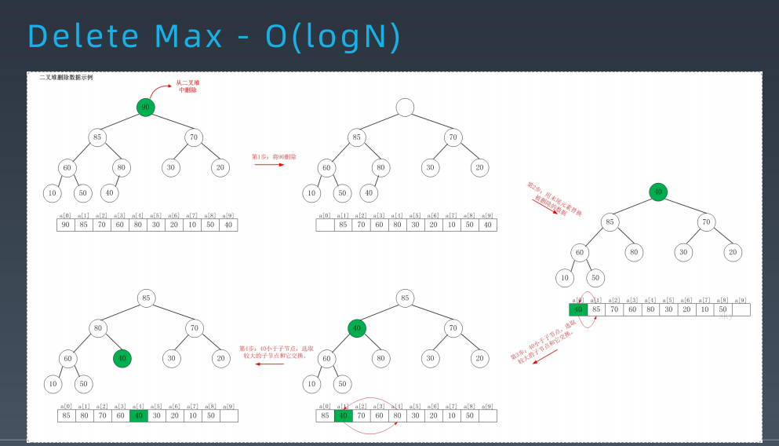

# 哈希表、映射、集合

1.由来

散列思想：
散列表利用的是数组支持以 O(1) 复杂度通过下标随机访问数据的特性，所以散列表其实就是数组的一种扩展，由数组演化而来。

2.定义

哈希表 (Hash table)，也叫散列表，是根据关键码值 (Key value) 而直接进行访问的数据结构。 它通过把关键码值映射到表中一个位置来访问记录，以加快查找的速度。 这个映射函数叫作散列函数 (Hash Function)，存放记录的数组叫作哈希表 (或散列表)。

## Java 语言中的 HashMap 源码分析

转载自 https://juejin.im/post/5dedb448f265da33b071716a,作者：六脉神剑

### Map

- Map是一个接口，存储key-value键值对，一个map不能包含重复的key，并且每一个key只能映射一个value；
- Map接口提供了三个集合视图：key的集合，value的集合，key-value的集合；
- Map内元素的顺序取决于Iterator的具体实现逻辑，获取集合内的元素实际上是获取一个迭代器，实现对其中元素的遍历；
- Map接口的具体实现中存在三种Map结构，其中HashMap和TreeMap都允许存在null值，而HashTable的key不允许为空，但是HashMap不能保证遍历元素的顺序，TreeMap能够保证遍历元素的顺序。

### HashMap

- 哈希表（HashTable，散列表）是根据key-value进行访问的数据结构，他是通过把key映射到表中的一个位置来访问value，加快查找的速度，其中映射的函数叫做散列函数，存放value的数组叫做散列表，哈希表的主干是数组。
- 存在的问题就是不同的值在经过hash函数之后可能会映射到相同的位置上，当插入一个元素时，发现该位置已经被占用，这时候就会产生冲突，也就是所谓的哈希冲突，因此哈希函数的设计就至关重要，一个好的哈希函数希望尽可能的保证计算方法简单，但是元素能够均匀的分布在数组中，但是数组是一块连续的且是固定长度的内存空间，不管一个哈希函数设计的多好，都无法避免得到的地址不会发生冲突，因此就需要对哈希冲突进行解决。 
  - （1）开放定址法：当插入一个元素时，发生冲突，继续检查散列表的其他项，直到找到一个位置来放置这个元素，至于检查的顺序可以自定义；
  - （2）再散列法：使用多个hash函数，如果一个发生冲突，使用下一个hash函数，直到找到一个位置，这种方法增加了计算的时间；
  - （3）链地址法：在数组的位置使用链表，将同一个hashCode的元素放在链表中，HashMap就是使用的这种方法，数组+链表的结构。

### HashMap类中的主要方法

```java
	// 默认的初始容量是16
    static final int DEFAULT_INITIAL_CAPACITY = 1 << 4;   
    // 最大容量
    static final int MAXIMUM_CAPACITY = 1 << 30; 
    // 默认的填充因子
    static final float DEFAULT_LOAD_FACTOR = 0.75f;
    // 当桶(bucket)上的结点数大于这个值时会转成红黑树
    static final int TREEIFY_THRESHOLD = 8; 
    // 当桶(bucket)上的结点数小于这个值时树转链表
    static final int UNTREEIFY_THRESHOLD = 6;
    // 桶中结构转化为红黑树对应的table的最小大小
    static final int MIN_TREEIFY_CAPACITY = 64;
    // 存储元素的数组，总是2的幂次倍
    transient Node<k,v>[] table; 
    // 存放具体元素的集
    transient Set<map.entry<k,v>> entrySet;
    // 存放元素的个数，注意这个不等于数组的长度。
    transient int size;
    // 每次扩容和更改map结构的计数器
    transient int modCount;   
    // 临界值 当实际大小(容量*填充因子)超过临界值时，会进行扩容
    int threshold;
    // 加载因子
    final float loadFactor;
```

### HashMap的Node实体

```java
static class Node<K,V> implements Map.Entry<K,V> {
    final int hash;
    final K key;
    V value;
    Node<K,V> next; // 指向下一个节点
    Node(int hash, K key, V value, Node<K,V> next) {
        this.hash = hash; // 哈希值，存放元素到hashmap中时用来与其他元素hash值比较
        this.key = key;
        this.value = value;
        this.next = next;
    }
    public final K getKey()        { return key; }
    public final V getValue()      { return value; }
    public final String toString() { return key + "=" + value; }
    // 重写hashCode()方法
    public final int hashCode() {
        return Objects.hashCode(key) ^ Objects.hashCode(value);
    }
    public final V setValue(V newValue) {
        V oldValue = value;
        value = newValue;
        return oldValue;
    }
    // 重写 equals() 方法
    public final boolean equals(Object o) {
        if (o == this)
            return true;
        if (o instanceof Map.Entry) {
            Map.Entry<?,?> e = (Map.Entry<?,?>)o;
            if (Objects.equals(key, e.getKey()) &&Objects.equals(value, e.getValue()))
                return true;
            }
        return false;
    }
}

```

### HashMap的构造方法

```java
/**
*使用默认的容量及装载因子构造一个空的HashMap
*/
public HashMap() {
    this.loadFactor = DEFAULT_LOAD_FACTOR;
}

/**
* 根据给定的初始容量和装载因子创建一个空的HashMap
* 初始容量小于0或装载因子小于等于0将报异常 
*/
public HashMap(int initialCapacity, float loadFactor) {
    if (initialCapacity < 0)
        throw new IllegalArgumentException("Illegal initial capacity: " +initialCapacity);
    if (initialCapacity > MAXIMUM_CAPACITY)//调整最大容量
        initialCapacity = MAXIMUM_CAPACITY;
    if (loadFactor <= 0 || Float.isNaN(loadFactor))
        throw new IllegalArgumentException("Illegal load factor: " +loadFactor);
    this.loadFactor = loadFactor;
    //这个方法就是把容量控制在2的倍数
        this.threshold = tableSizeFor(initialCapacity);
        
}

/**
*根据指定容量创建一个空的HashMap
*/
public HashMap(int initialCapacity) {
    //调用上面的构造方法，容量为指定的容量，装载因子是默认值
    this(initialCapacity, DEFAULT_LOAD_FACTOR);
}
//通过传入的map创建一个HashMap，容量为默认容量（16）和(map.zise()/DEFAULT_LOAD_FACTORY)+1的较大者，装载因子为默认值
public HashMap(Map<? extends K, ? extends V> m) {
    this.loadFactor = DEFAULT_LOAD_FACTOR;
    putMapEntries(m, false);
}

```

HashMap提供了四种构造方法：

（1）使用默认的容量及装载因子构造一个空的HashMap；

（2）根据给定的初始容量和装载因子创建一个空的HashMap；

（3）根据指定容量创建一个空的HashMap；

（4）通过传入的map创建一个HashMap。

第三种构造方法会调用第二种构造方法，而第四种构造方法将会调用putMapEntries方法将元素添加到HashMap中去。

putMapEntries方法是一个final方法，不可以被修改，该方法实现了将另一个Map的所有元素加入表中，参数evict初始化时为false，其他情况为true

```java
final void putMapEntries(Map<? extends K, ? extends V> m, boolean evict) {
    int s = m.size();
    if (s > 0) {
        if (table == null) { 
        //根据m的元素数量和当前表的加载因子，计算出阈值
        float ft = ((float)s / loadFactor) + 1.0F;
        //修正阈值的边界 不能超过MAXIMUM_CAPACITY
        int t = ((ft < (float)MAXIMUM_CAPACITY) ?(int)ft : MAXIMUM_CAPACITY);
        //如果新的阈值大于当前阈值
        if (t > threshold)
            //返回一个>=新的阈值的 满足2的n次方的阈值
            threshold = tableSizeFor(t);
        }
        //如果当前元素表不是空的，但是 m的元素数量大于阈值，说明一定要扩容。
        else if (s > threshold)
            resize();
        //遍历 m 依次将元素加入当前表中。
        for (Map.Entry<? extends K, ? extends V> e : m.entrySet()) {
            K key = e.getKey();
            V value = e.getValue();
            putVal(hash(key), key, value, false, evict);
        }
    }
}

```

从中可以看出，它这个涉及了2个操作，一个是计算新的阈值，另一个是扩容方法

如果新的阈值大于当前阈值，需要返回一个>=新的阈值的 满足2的n次方的阈值，这涉及到了tableSizeFor：

```java
  static final int tableSizeFor(int cap) {
        int n = cap - 1;
        n |= n >>> 1;
        n |= n >>> 2;
        n |= n >>> 4;
        n |= n >>> 8;
        n |= n >>> 16;
        return (n < 0) ? 1 : (n >= MAXIMUM_CAPACITY) ? MAXIMUM_CAPACITY : n + 1;
    }

```

如果当前元素表不是空的，但是 m的元素数量大于阈值，说明一定要扩容。这涉及到了扩容方法resize。最复杂的方法之一

```java
final Node<K,V>[] resize() {
    //oldTab 为当前表的哈希桶
    Node<K,V>[] oldTab = table;
    //当前哈希桶的容量 length
    int oldCap = (oldTab == null) ? 0 : oldTab.length;
    //当前的阈值
    int oldThr = threshold;
    //初始化新的容量和阈值为0
    int newCap, newThr = 0;
    //如果当前容量大于0
    if (oldCap > 0) {
        //如果当前容量已经到达上限
        if (oldCap >= MAXIMUM_CAPACITY) {
            //则设置阈值是2的31次方-1
            threshold = Integer.MAX_VALUE;
            //同时返回当前的哈希桶，不再扩容
            return oldTab;
        }//否则新的容量为旧的容量的两倍。 
        else if ((newCap = oldCap << 1) < MAXIMUM_CAPACITY &&
            oldCap >= DEFAULT_INITIAL_CAPACITY)
            //如果旧的容量大于等于默认初始容量16
            //那么新的阈值也等于旧的阈值的两倍
            newThr = oldThr << 1; // double threshold
    }
    //如果当前表是空的，但是有阈值。代表是初始化时指定了容量、阈值的情况
    else if (oldThr > 0) 
        newCap = oldThr;//那么新表的容量就等于旧的阈值
    else {    
    //如果当前表是空的，而且也没有阈值。代表是初始化时没有任何容量/阈值参数的情况               
        newCap = DEFAULT_INITIAL_CAPACITY;//此时新表的容量为默认的容量 16
    //新的阈值为默认容量16 * 默认加载因子0.75f = 12
        newThr = (int)(DEFAULT_LOAD_FACTOR * DEFAULT_INITIAL_CAPACITY);
    }
    if (newThr == 0) {
        //如果新的阈值是0，对应的是  当前表是空的，但是有阈值的情况
        float ft = (float)newCap * loadFactor;//根据新表容量 和 加载因子 求出新的阈值
        //进行越界修复
        newThr = (newCap < MAXIMUM_CAPACITY && ft <(float)MAXIMUM_CAPACITY ? (int)ft : Integer.MAX_VALUE);
    }
    //更新阈值 
    threshold = newThr;
    @SuppressWarnings({"rawtypes","unchecked"})
    //根据新的容量 构建新的哈希桶
    Node<K,V>[] newTab = (Node<K,V>[])new Node[newCap];
    //更新哈希桶引用
    table = newTab;
    //如果以前的哈希桶中有元素
    //下面开始将当前哈希桶中的所有节点转移到新的哈希桶中
    if (oldTab != null) {
        //遍历老的哈希桶
        for (int j = 0; j < oldCap; ++j) {
        //取出当前的节点 e
        Node<K,V> e;
        //如果当前桶中有元素,则将链表赋值给e
        if ((e = oldTab[j]) != null) {
            //将原哈希桶置空以便GC
            oldTab[j] = null;
            //如果当前链表中就一个元素，（没有发生哈希碰撞）
            if (e.next == null)
            //直接将这个元素放置在新的哈希桶里。
            //注意这里取下标 是用 哈希值 与 桶的长度-1 。 由于桶的长度是2的n次方，这么做其实是等于 一个模运算。但是效率更高
            newTab[e.hash & (newCap - 1)] = e;
            //如果发生过哈希碰撞 ,而且是节点数超过8个，转化成了红黑树
            else if (e instanceof TreeNode)
                 ((TreeNode<K,V>)e).split(this, newTab, j, oldCap);
            //如果发生过哈希碰撞，节点数小于8个。则要根据链表上每个节点的哈希值，依次放入新哈希桶对应下标位置。
            else {
                //因为扩容是容量翻倍，所以原链表上的每个节点，现在可能存放在原来的下标，即low位，或者扩容后的下标，即high位。high位=low位+原哈希桶容量
                //低位链表的头结点、尾节点
                Node<K,V> loHead = null, loTail = null;
                //高位链表的头节点、尾节点
                Node<K,V> hiHead = null, hiTail = null;
                Node<K,V> next;//临时节点 存放e的下一个节点
                do {
                    next = e.next;
                &emsp;&emsp;//利用位运算代替常规运算：利用哈希值与旧的容量，可以得到哈希值去模后，是大于等于oldCap还是小于oldCap，等于0代表小于oldCap，应该存放在低位，否则存放在高位
                    if ((e.hash & oldCap) == 0) {
                        //给头尾节点指针赋值
                        if (loTail == null)
                            loHead = e;
                        else
                            loTail.next = e;
                        loTail = e;
                    }//高位也是相同的逻辑
                    else {
                        if (hiTail == null)
                            hiHead = e;
                        else
                            hiTail.next = e;
                        hiTail = e;
                        }//循环直到链表结束
                    } while ((e = next) != null);
                    //将低位链表存放在原index处
                    if (loTail != null) {
                        loTail.next = null;
                        newTab[j] = loHead;
                    }
                    //将高位链表存放在新index处
                    if (hiTail != null) {
                        hiTail.next = null;
                        newTab[j + oldCap] = hiHead;
                    }
                }
            }
        }
    }
    return newTab;
}

```

resize的操作主要涉及以下几步操作：

- 如果到达最大容量，那么返回当前的桶，并不再进行扩容操作，否则的话扩容为原来的两倍，返回扩容后的桶；
- 根据扩容后的桶，修改其他的成员变量的属性值；
- 根据新的容量创建新的扩建后的桶，并更新桶的引用；
- 如果原来的桶里面有元素就需要进行元素的转移；
- 在进行元素转移的时候需要考虑到元素碰撞和转红黑树操作；
- 在扩容的过程中，按次从原来的桶中取出链表头节点，并对该链表上的所有元素重新计算hash值进行分配；
- 在发生碰撞的时候，将新加入的元素添加到末尾；
- 在元素复制的时候需要同时对低位和高位进行操作。

这段是借鉴人家的，确实很复杂，各种if else ，一点点去跟，也很累，但是大家至少也要知道它是怎么扩容的，几个重要的步骤要能说出来，面试的时候会问。


# 树、二叉树、二叉搜索树

> Linked List 是特殊化的 Tree, Tree 是特殊化的 Graph

## 树

- 由节点组成
  - 父节点 
  - 子节点 
  - 兄弟节点 
  - 根节点 
  - 叶子节点
- 树的高度 = 根节点的高度
- 节点的高度 = 该节点到叶子节点的最长路径(边数)
- 节点的深度 = 根节点到该节点所经历的边的个数
- 节点的层数 = 节点的深度 + 1


## 二叉树

- 每个节点最多有两个“叉”，分别被称为左子节点和右子节点

### 分类

- 满二叉树
  - 叶子节点全都在最底层
  - 除了叶子节点外，每个节点都有左右两个子节点

- 完全二叉树
  - 除了最后一层外，其他层的节点个数都是满的
  - 最后一层的叶子节点都靠左排列

### 遍历

- 1.前序（Pre-order）：根-左-右 
- 2.中序（In-order）：左-根-右 
- 3.后序（Post-order）：左-右-根


### 二叉搜索树 Binary Search Tree

- 二叉搜索树，也称二叉搜索树、有序二叉树（Ordered Binary Tree）、 排序二叉树（Sorted Binary Tree），是指一棵空树或者具有下列性质的 二叉树： 
  - 左子树上所有结点的值均小于它的根结点的值；
  - 右子树上所有结点的值均大于它的根结点的值； 
  - 以此类推：左、右子树也分别为二叉查找树。 （这就是 重复性！） 

# 堆、二叉堆、图





















