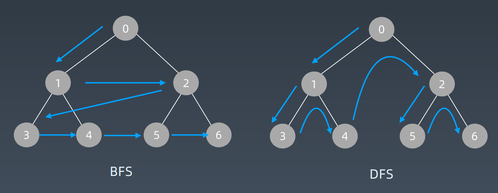

# 学习笔记


## 二分查找半有序数组

##### 题意

> 使用二分查找，寻找一个半有序数组 [4, 5, 6, 7, 0, 1, 2] 中间无序的地方

##### 思路

- 原数组可由递增数组旋转得来，所以问题等价于寻找最小元素在旋转数组中下标
- 可以设定两个下标 low 和 high，并设定 mid = (low + high)/2，找到数组中间的元素 array[mid]
- 如果中间的元素位于前面的递增数组，那么它应该大于或者等于 low 下标对应的元素，此时数组中最小的元素应该位于该元素的后面，可以把 low 下标指向该中间元素，这样可以缩小查找的范围。
- 同样，如果中间元素位于后面的递增子数组，那么它应该小于或者等于 high 下标对应的元素。此时该数组中最小的元素应该位于该中间元素的前面。就可以把 high 下标更新到中位数的下标，这样也可以缩小查找的范围，移动之后的 high 下标对应的元素仍然在后面的递增子数组中。
- 不管是更新 low 还是 high，查找范围都会缩小为原来的一半，接下来我们再用更新的下标去重复新一轮的查找。直到最后两个下标相邻，也就是我们的循环结束条件。

##### 解法

-  二分查找

  ```java
  public static int getTheChange(int nums[]) {
  	if (nums == null || nums.length == 0) {
      	throw new RuntimeException("input error!");
      }
  	// 如果只有一个元素，直接返回
  	if (nums.length == 1)
  		return nums[0];
  	
      int result = nums[0];
      int low = 0, high = nums.length - 1;
      int mid;
  	// 确保 low 下标对应的值在左边的递增子数组，high 对应的值在右边递增子数组
  	while (nums[low] >= nums[high]) {
          // 确保循环结束条件
          if (high - low == 1) {
              return nums[high];
          }
          // 取中间位置
          mid = (low + high) / 2;
          // 代表中间元素在左边递增子数组
          if (nums[mid] >= nums[low]) {
              low = mid;
          } else {
              high = mid;
          }
  	}
  	return result;
  }
  ```

  

  

## 搜索查找

### 遍历

#### 定义

- 每个节点都要访问一次 
- 每个节点仅仅要访问一次 
- 对于节点的访问顺序不限 

#### 分类

- 深度优先：depth first search  
- 广度优先：breadth first search
- 

#### 深度优先搜索

- 代码

  ```python
  # 递归写法
  visited = set()
  def dfs(node, visited):
  	if node in visited: # terminator
  		# already visited
  		return
   	
      visited.add(node)
  	# process current node here.
  	...
  	for next_node in node.children():
   		if not next_node in visited:
   			dfs(next node, visited)
  
  # 非递归写法
  def DFS(self, tree):
  	if tree.root is None:
   		return []
   
  	visited, stack = [], [tree.root]
  	while stack:
           node = stack.pop()
           visited.add(node)
           process (node)
           nodes = generate_related_nodes(node)
           stack.push(nodes)
  	# other processing work
  	...
  ```

- 

#### 广度优先搜索

- 代码

  ```python
  # 递归写法
  
  visited = set()
  
  def dfs(node, visited):
  	visited.add(node)
  	
      # process current node here.
  	...
  	
      for next_node in node.children():
  		if not next_node in visited:
              dfs(next node, visited) 
  
  # 非递归写法
  def BFS(graph, start, end):
  	queue = []
  	queue.append([start])
  	visited.add(start)
  	while queue:
           node = queue.pop()
           visited.add(node)
           process(node)
           nodes = generate_related_nodes(node)
           queue.push(nodes)
      # other processing work
      ...
  ```

  

### 贪心算法 Greedy

#### 定义

- 贪心算法是一种在每一步选择中都采取在当前状态下最好或最优（即最有 利）的选择，从而希望导致结果是全局最好或最优的算法

#### 特点

- 贪心算法与动态规划的不同在于它对每个子问题的解决方案都做出选择，不能回退。动态规划则会保存以前的运算结果，并根据以前的结果对当前进行选择，有回退功能
- 对于工程和生活中的问题，贪心法一般不能得到我们所要求的答案
- 一旦一个问题可以通过贪心法来解决，那么贪心法一般是解决这个问题的最好办法
- 由于贪心法的高效性以及其所求得的答案比较接近最优结果，贪心法也可以用作辅助算法或者直接解决一些要求结果不特别精确的问题

#### 适用贪心算法的场景

- 贪心法可以解决一些最优化问题，如：求图中的最小生成树、求哈夫曼编码等
- 简单地说，问题能够分解成子问题来解决，子问题的最优解能递推到最终问题的最优解，则这种子问题最优解称为最优子结构。 
- 贪心算法与动态规划的不同在于它对每个子问题的解决方案都做出选择，不能回退。动态规划则会保存以前的运算结果，并根据以前的结果对当前进行选择，有回退功能。

#### LeetCode

Coin Change 特别版本： https://leetcode-cn.com/problems/coin-change/

1.https://leetcode-cn.com/problems/lemonade-change/description/ 

2.https://leetcode-cn.com/problems/best-time-to-buy-and-sellstock-ii/description/ 

3.https://leetcode-cn.com/problems/assign-cookies/description/ 

4.https://leetcode-cn.com/problems/walking-robot-simulation/description/  

5.https://leetcode-cn.com/problems/jump-game/ 

https://leetcode-cn.com/problems/jump-game-ii/


### 二分查找

#### 前提

- 1.目标函数单调性（单调递增或者递减） 
- 2.存在上下界（bounded） 
- 3.能够通过索引访问（index accessible)

#### 代码

- 代码模板

  ```python
  left, right = 0, len(array) - 1
  while left <= right:
  	mid = (left + right) / 2
  	if array[mid] == target:
   		# find the target!!
   		break or return result
   	elif array[mid] < target:
   		left = mid + 1
   	else:
   		right = mid - 1
  ```

#### LeetCode

- https://leetcode-cn.com/problems/sqrtx/  （[扩展阅读](https://www.beyond3d.com/content/articles/8/)） 
- https://leetcode.com-cn/problems/valid-perfect-square/
- https://leetcode-cn.com/problems/search-in-rotated-sortedarray/  
- https://leetcode-cn.com/problems/search-a-2d-matrix/ 
- https://leetcode-cn.com/problems/find-minimum-in-rotatedsorted-array/