学习笔记

# 1.字典树和并查集

## 字典树

### 定义

字典树，即 Trie 树，又称单词 查找树或键树，是一种树形结 构。典型应用是用于统计和排 序大量的字符串（但不仅限于 字符串），所以经常被搜索引 擎系统用于文本词频统计。

它的优点是：最大限度地减少 无谓的字符串比较，查询效率 比哈希表高。


### 基本性质

1.结点本身不存完整单词； 

2.从根结点到某一结点，路径上经过的字符连接起来，为该结点对应的 字符串； 

3.每个结点的所有子结点路径代表的字符都不相同。


### 结点内部实现

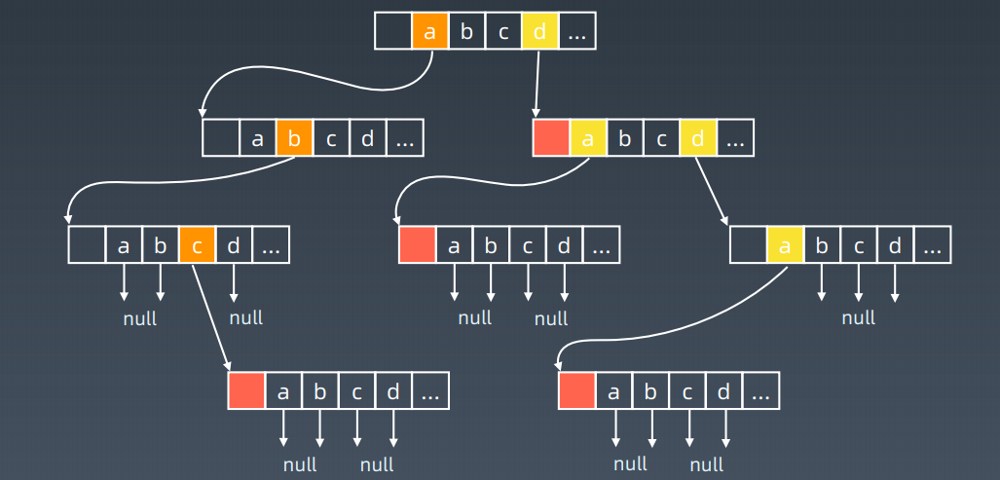


### 核心思想

Trie 树的核心思想是空间换时间。 

利用字符串的公共前缀来降低查询时间的开销以达到提高效率的目的。


### 实战题目

1.https://leetcode-cn.com/problems/implement-trie-prefix-tree/#/description 

2.https://leetcode-cn.com/problems/word-search-ii/ 

3.Search suggestion - system design


## 并查集


### Union-Find

#### 适用场景

> 组团、配对问题  Group or not ? 

Union-Find 算法，也就是常说的并查集算法，主要是解决图论中「动态连通性」问题


#### 动态连通性?

这里所说的「连通」是一种等价关系，也就是说具有如下三个性质：

1、自反性：节点p和p是连通的。

2、对称性：如果节点p和q连通，那么q和p也连通。

3、传递性：如果节点p和q连通，q和r连通，那么p和r也连通。


#### 算法关键

判断这种「等价关系」非常实用，比如说编译器判断同一个变量的不同引用，比如社交网络中的朋友圈计算等等

Union-Find 算法主要需要实现这两个 API

Union-Find 算法的关键就在于`union`和`connected`函数的效率

```java
class UF {
    /* 将 p 和 q 连接 */
    public void union(int p, int q);
    /* 判断 p 和 q 是否连通 */
    public boolean connected(int p, int q);
    /* 返回图中有多少个连通分量 */
    public int count();
}
```


#### 模型和数据结构

用什么模型来表示这幅图的连通状态呢？用什么数据结构来实现代码呢？

> 用森林（若干棵树）来表示图的动态连通性，用数组来具体实现这个森林

怎么用森林来表示连通性呢？

> 我们设定树的每个节点有一个指针指向其父节点，如果是根节点的话，这个指针指向自己。
>
> **如果某两个节点被连通，则让其中的（任意）一个节点的根节点接到另一个节点的根节点上**：
>
> 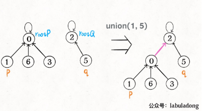
>
> **这样，如果节点`p`和`q`连通的话，它们一定拥有相同的根节点**：
>
> 用数组来模拟出一个森林，如此巧妙的解决比较复杂的问题！


#### 代码

Java

```java
class UF {
    // 记录连通分量
    private int count;
    // 节点 x 的节点是 parent[x]
    private int[] parent;

    /* 构造函数，n 为图的节点总数 */
    public UF(int n) {
        // 一开始互不连通
        this.count = n;
        // 父节点指针初始指向自己
        parent = new int[n];
        for (int i = 0; i < n; i++)
            parent[i] = i;
    }

    public void union(int p, int q) {
        int rootP = find(p);
        int rootQ = find(q);
        if (rootP == rootQ)
            return;
        // 将两棵树合并为一棵
        parent[rootP] = rootQ;
        // parent[rootQ] = rootP 也一样
        count--; // 两个分量合二为一
    }

    /* 返回某个节点 x 的根节点 */
    private int find(int x) {
        // 根节点的 parent[x] == x
        while (parent[x] != x)
            x = parent[x];
        return x;
    }

    /* 返回当前的连通分量个数 */
    public int count() { 
        return count;
    }

	public boolean connected(int p, int q) {
    int rootP = find(p);
    int rootQ = find(q);
    return rootP == rootQ;
	}
}
作者：labuladong 链接：https://leetcode-cn.com/problems/friend-circles/solution/union-find-suan-fa-xiang-jie-by-labuladong/
```


#### 算法的复杂度

> 主要 API`connected`和`union`中的复杂度都是`find`函数造成的，所以说它们的复杂度和`find`一样。

`find`主要功能就是从某个节点向上遍历到树根，其时间复杂度就是树的高度。我们可能习惯性地认为树的高度就是`logN`，但这并不一定。`logN`的高度只存在于平衡二叉树，对于一般的树可能出现极端不平衡的情况，使得「树」几乎退化成「链表」，树的高度最坏情况下可能变成N。

所以说上面这种解法，`find,union,connected`的时间复杂度都是 `O(N)`。这个复杂度很不理想的，你想图论解决的都是诸如社交网络这样数据规模巨大的问题，对于`union`和`connected`的调用非常频繁，每次调用需要线性时间完全不可忍受。

**问题的关键在于，如何想办法避免树的不平衡呢**？只需要略施小计即可。


### 平衡性优化

如何想办法避免树的不平衡呢，**关键在于`union`过程**

我们一开始就是简单粗暴的把`p`所在的树接到`q`所在的树的根节点下面，那么这里就可能出现「头重脚轻」的不平衡状况，比如下面这种局面：

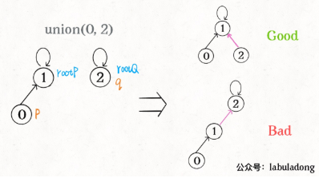

长此以往，树可能生长得很不平衡。我们其实是希望，小一些的树接到大一些的树下面，这样就能避免头重脚轻，更平衡一些。解决方法是额外使用一个size数组，记录每棵树包含的节点数，我们不妨称为「重量」

```java
class UF {
    private int count;
    private int[] parent;
    // 新增一个数组记录树的“重量”
    private int[] size;

    public UF(int n) {
        this.count = n;
        parent = new int[n];
        // 最初每棵树只有一个节点
        // 重量应该初始化 1
        size = new int[n];
        for (int i = 0; i < n; i++) {
            parent[i] = i;
            size[i] = 1;
        }
    }
    /* 其他函数 */
}

```

修改一下`union`方法：

```java
public void union(int p, int q) {
    int rootP = find(p);
    int rootQ = find(q);
    if (rootP == rootQ)
        return;
    
    // 小树接到大树下面，较平衡
    if (size[rootP] > size[rootQ]) {
        parent[rootQ] = rootP;
        size[rootP] += size[rootQ];
    } else {
        parent[rootP] = rootQ;
        size[rootQ] += size[rootP];
    }
    count--;
}
```

通过比较树的重量，就可以保证树的生长相对平衡，树的高度大致在`logN`这个数量级，极大提升执行效率。

此时，`find`,`union`,`connected`的时间复杂度都下降为 O(logN)，即便数据规模上亿，所需时间也非常少。


### 路径压缩

这步优化特别简单，所以非常巧妙。我们能不能进一步压缩每棵树的高度，使树高始终保持为常数？

要做到这一点，非常简单，只需要在`find`中加一行代码：

```java
private int find(int x) {
    while (parent[x] != x) {
        // 进行路径压缩
        parent[x] = parent[parent[x]];
        x = parent[x];
    }
    return x;
}

作者：labuladong 链接：https://leetcode-cn.com/problems/friend-circles/solution/union-find-suan-fa-xiang-jie-by-labuladong/
```


可见，调用`find`函数每次向树根遍历的同时，顺手将树高缩短了，最终所有树高都不会超过 3（`union`的时候树高可能达到 3）。

PS：读者可能会问，这个 GIF 图的find过程完成之后，树高恰好等于 3 了，但是如果更高的树，压缩后高度依然会大于 3 呀？不能这么想。这个 GIF 的情景是我编出来方便大家理解路径压缩的，但是实际中，每次find都会进行路径压缩，所以树本来就不可能增长到这么高，你的这种担心应该是多余的。


### 总结

##### 代码

```java
class UF {
    // 连通分量个数
    private int count;
    // 存储一棵树
    private int[] parent;
    // 记录树的“重量”
    private int[] size;

    public UF(int n) {
        this.count = n;
        parent = new int[n];
        size = new int[n];
        for (int i = 0; i < n; i++) {
            parent[i] = i;
            size[i] = 1;
        }
    }
    
    public void union(int p, int q) {
        int rootP = find(p);
        int rootQ = find(q);
        if (rootP == rootQ)
            return;
        
        // 小树接到大树下面，较平衡
        if (size[rootP] > size[rootQ]) {
            parent[rootQ] = rootP;
            size[rootP] += size[rootQ];
        } else {
            parent[rootP] = rootQ;
            size[rootQ] += size[rootP];
        }
        count--;
    }

    public boolean connected(int p, int q) {
        int rootP = find(p);
        int rootQ = find(q);
        return rootP == rootQ;
    }

    private int find(int x) {
        while (parent[x] != x) {
            // 进行路径压缩
            parent[x] = parent[parent[x]];
            x = parent[x];
        }
        return x;
    }

    public int count() {
        return count;
    }
}
作者：labuladong 链接：https://leetcode-cn.com/problems/friend-circles/solution/union-find-suan-fa-xiang-jie-by-labuladong/
```


##### 复杂度分析

构造函数初始化数据结构需要 `O(N)` 的时间和空间复杂度；

连通两个节点`union`、判断两个节点的连通性`connected`、计算连通分量`count`所需的时间复杂度均为 `O(1)`。


### 超哥课件

#### 基本操作

makeSet(s)：建立一个新的并查集，其中包含 s 个单元素集合。 • 

unionSet(x, y)：把元素 x 和元素 y 所在的集合合并，要求 x 和 y 所在 的集合不相交，如果相交则不合并。 

find(x)：找到元素 x 所在的集合的代表，该操作也可以用于判断两个元 素是否位于同一个集合，只要将它们各自的代表比较一下就可以了。


##### 初始化

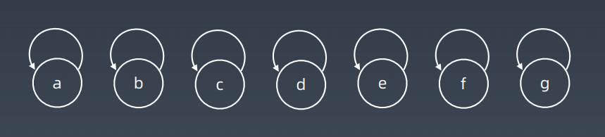

##### 查询、合并

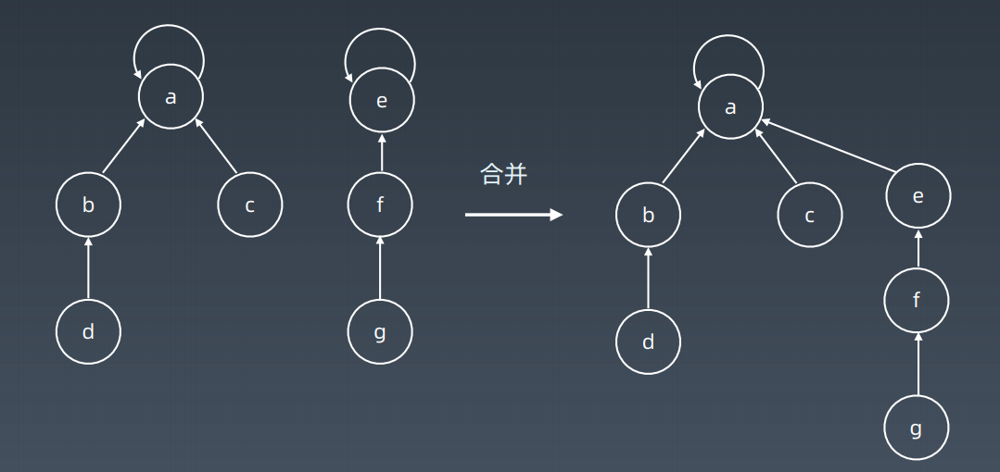

##### 路径压缩

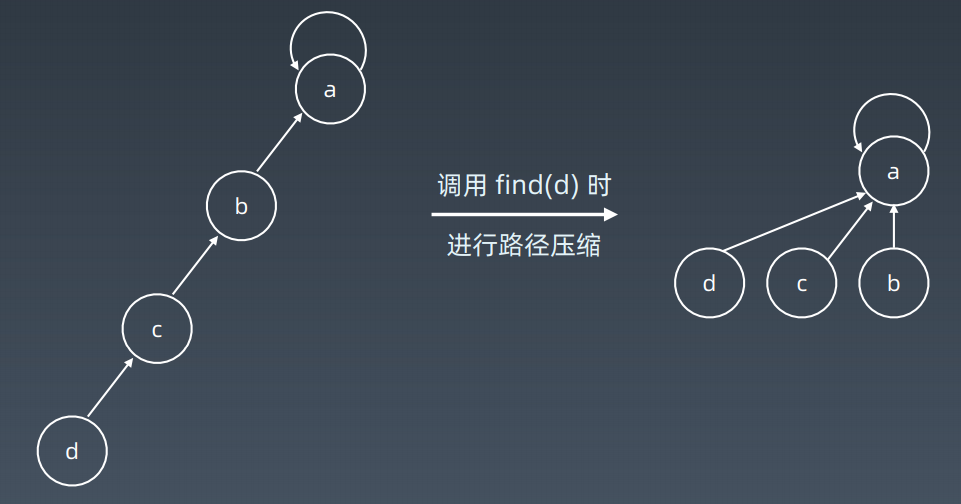


#### 代码

##### Java

```java
class UnionFind {
    private int count = 0;
    private int[] parent;
    public UnionFind(int n) {
         count = n;
         parent = new int[n];
         for (int i = 0; i < n; i++) {
         	parent[i] = i;
         }
	}
    public int find(int p) {
         while (p != parent[p]) {
             parent[p] = parent[parent[p]];
             p = parent[p];
         }
         return p;
    }
    public void union(int p, int q) {
         int rootP = find(p);
         int rootQ = find(q);
         if (rootP == rootQ) return;
         parent[rootP] = rootQ;
         count--;
        }
}
```


##### Python

```python
def init(p):
	# for i = 0 .. n: p[i] = i;
	p = [i for i in range(n)]
def union(self, p, i, j):
	p1 = self.parent(p, i)
	p2 = self.parent(p, j)
	p[p1] = p2
def parent(self, p, i):
	root = i
	while p[root] != root:
 		root = p[root]
	while p[i] != i: # 路径压缩 ?
 		x = i; i = p[i]; p[x] = root
	return root
```


### 实战题目

• https://leetcode-cn.com/problems/friend-circles 

• https://leetcode-cn.com/problems/number-of-islands/ 

• https://leetcode-cn.com/problems/surrounded-regions/

# 2.高级搜索

## 初级搜索

1.朴素搜索 

2.优化方式：不重复（fibonacci）、剪枝（生成括号问题） 

3.搜索方向： 

DFS: depth first search 深度优先搜索 

BFS: breadth first search 广度优先搜索 

双向搜索、启发式搜索


## 剪枝 

### 回溯法

回溯法采用试错的思想，它尝试分步的去解决一个问题。在分步解决问题的过程中，当 它通过尝试发现现有的分步答案不能得到有效的正确的解答的时候，它将取消上一步甚 至是上几步的计算，再通过其它的可能的分步解答再次尝试寻找问题的答案。 

回溯法通常用最简单的递归方法来实现，在反复重复上述的步骤后可能出现两种情况： 

• 找到一个可能存在的正确的答案 

• 在尝试了所有可能的分步方法后宣告该问题没有答案 

在最坏的情况下，回溯法会导致一次复杂度为指数时间的计算。


### 实战练习 

• https://leetcode-cn.com/problems/climbing-stairs/  

• https://leetcode-cn.com/problems/generate-parentheses/

1.https://leetcode-cn.com/problems/n-queens/ 

2.https://leetcode-cn.com/problems/valid-sudoku/description/ 

3.https://leetcode-cn.com/problems/sudoku-solver/#/description


### 八皇后代码

```python
def solveNQueens(self, n):
    if n < 1: return []
    self.result = []
    self.cols = set(); self.pie = set(); self.na = set()
    self.DFS(n, 0, [])
    return self._generate_result(n)
def DFS(self, n, row, cur_state):
    # recursion terminator
    if row >= n:
    	self.result.append(cur_state)
    	return
    for col in range(n):
    	if col in self.cols or row + col in self.pie or row - col in self.na:
    	# go die!
    	continue
    
    	# update the flags
        self.cols.add(col)
        self.pie.add(row + col)
        self.na.add(row - col)
        self.DFS(n, row + 1, cur_state + [col])
        self.cols.remove(col)
        self.pie.remove(row + col)
        self.na.remove(row - col)
```

LeetCode 讨论区

• https://leetcode.com/problems/n-queens/discuss/19808/Accepted-4ms-c%2B%2B-solution-use-backtracking-and-bitmaskeasy-understand  

• https://leetcode.com/problems/n-queens/discuss/19810/Fast-shortand-easy-to-understand-python-solution-11-lines-76ms


## 双向 BFS 

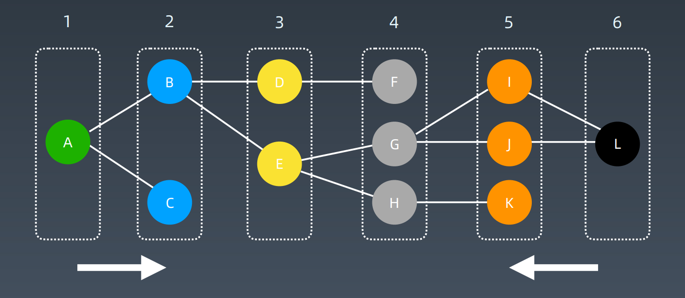

### 实战题目

1.https://leetcode-cn.com/problems/word-ladder/ 

2.https://leetcode-cn.com/problems/minimum-geneticmutation/


## 启发式搜索 Heuristic Search（A*）

### 代码

```python
def AstarSearch(graph, start, end):
     pq = collections.priority_queue() # 优先级 —> 估价函数
     pq.append([start])
     visited.add(start)
	while pq:
         node = pq.pop() # can we add more intelligence here ?
         visited.add(node)
         process(node)
         nodes = generate_related_nodes(node)
         unvisited = [node for node in nodes if node not in visited]
         pq.push(unvisited) 
```


### 估价函数

启发式函数： h(n)，它用来评价哪些结点最有希望的是一个我们要找的结 点，h(n) 会返回一个非负实数,也可以认为是从结点n的目标结点路径的估 计成本。 

启发式函数是一种告知搜索方向的方法。它提供了一种明智的方法来猜测 哪个邻居结点会导向一个目标。


### 实战题目

1.https://leetcode-cn.com/problems/shortest-path-in-binarymatrix/  

2.https://leetcode-cn.com/problems/sliding-puzzle/ 

3.https://leetcode-cn.com/problems/sudoku-solver/

#### Shortest Path

> 1.BFS: 经典的BFS代码 
>
> 2.A* search 估价函数：
>
>  `h(current_point) = dist(current_point, destination_point)` 
>
> https://dataaspirant.com/2015/04/11/five-most-popular-similaritymeasures-implementation-in-python/ 
>
> 3.https://leetcode.com/problems/shortest-path-in-binary-matrix/discuss/313347/A*-search-in-Python

#### [773. 滑动谜题](https://leetcode-cn.com/problems/sliding-puzzle/)

> 1.BFS: 经典的BFS代码: https://leetcode-cn.com/problems/sliding-puzzle/submissions/  
>
> 2.A* search 估价函数：
>
>  `h(current_state) = distance(current_state, target_state)`
>
> 3.https://zxi.mytechroad.com/blog/searching/8-puzzlesbidirectional-astar-vs-bidirectional-bfs/

# 3.高级树、AVL 树和红黑树


## 二叉搜索树 Binary Search Tree

### 定义

二叉搜索树，也称二叉搜索树、有序二叉树（Ordered Binary Tree）、排 序二叉树（Sorted Binary Tree），是指一棵空树或者具有下列性质的二叉 树： 

1.左子树上所有结点的值均小于它的根结点的值； 

2.右子树上所有结点的值均大于它的根结点的值； 

3.以此类推：左、右子树也分别为二叉查找树。 （这就是 重复性！） 

中序遍历：升序排列


### 保证性能的关键

1.保证二维维度！ —> 左右子树结点平衡（recursively） 

2.Balanced 

3.https://en.wikipedia.org/wiki/Self-balancing_binary_search_tree


## AVL 树

1.发明者 G. M. Adelson-Velsky和 Evgenii Landis 

2.Balance Factor（平衡因子）： 是它的左子树的高度减去它的右子树的高度（有时相反）。 balance factor = {-1, 0, 1} 

3.通过旋转操作来进行平衡（四种） 

4.https://en.wikipedia.org/wiki/Self-balancing_binary_search_tree


### 旋转操作

#### 1.左旋 

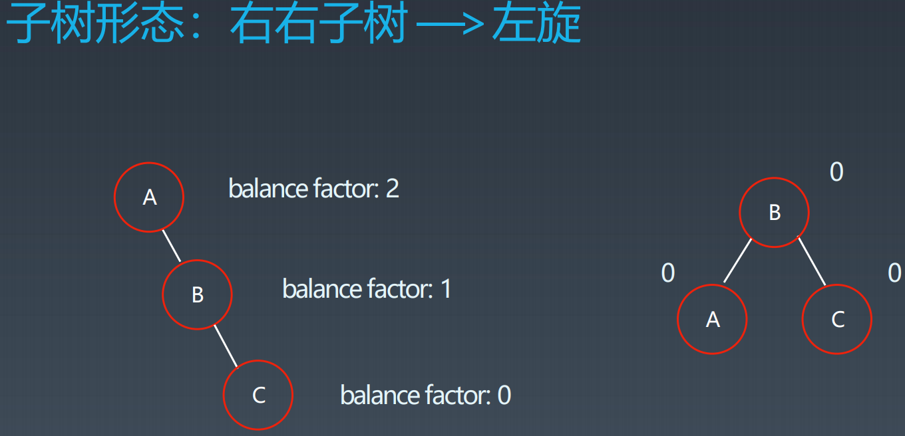

#### 2.右旋 

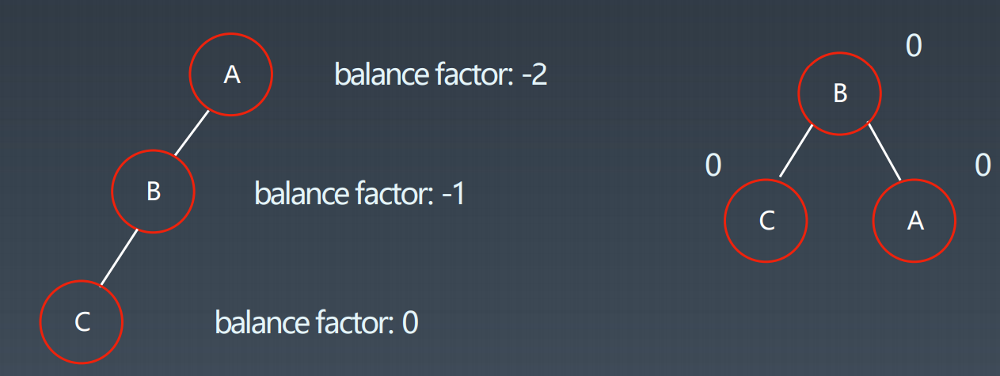

#### 3.左右旋 

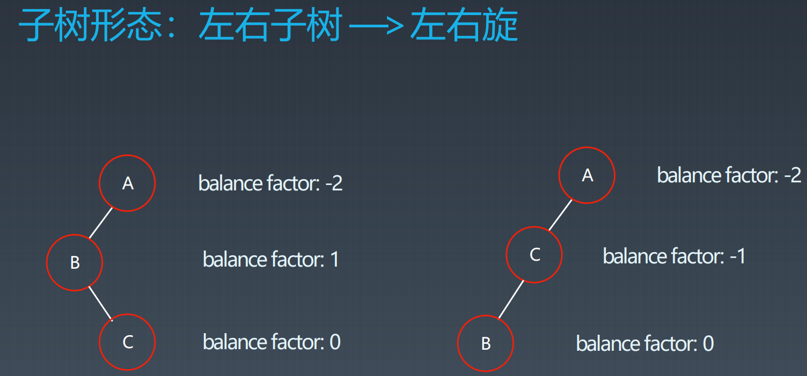

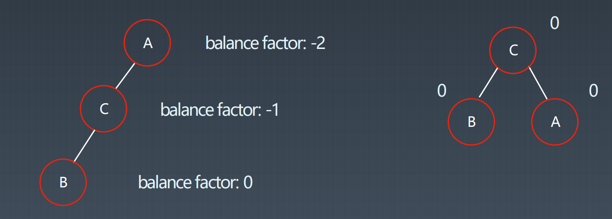

#### 4.右左旋

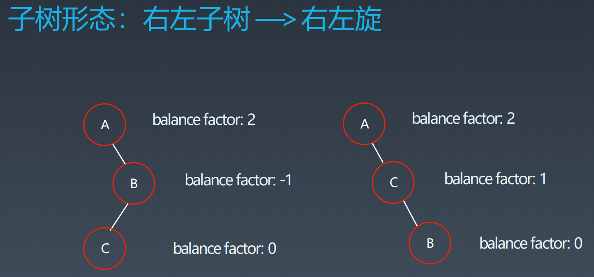

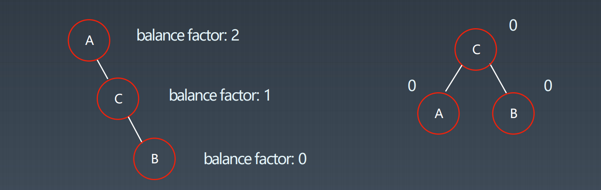


### 带有子树的旋转

参考动画： https://zhuanlan.zhihu.com/p/63272157

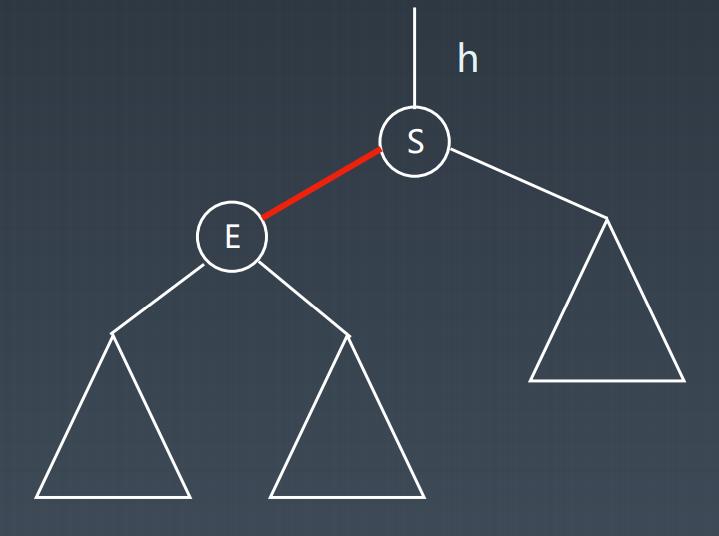

https://en.wikipedia.org/wiki/Tree_rotation#/media/File:Tree_Rebalancing.gif

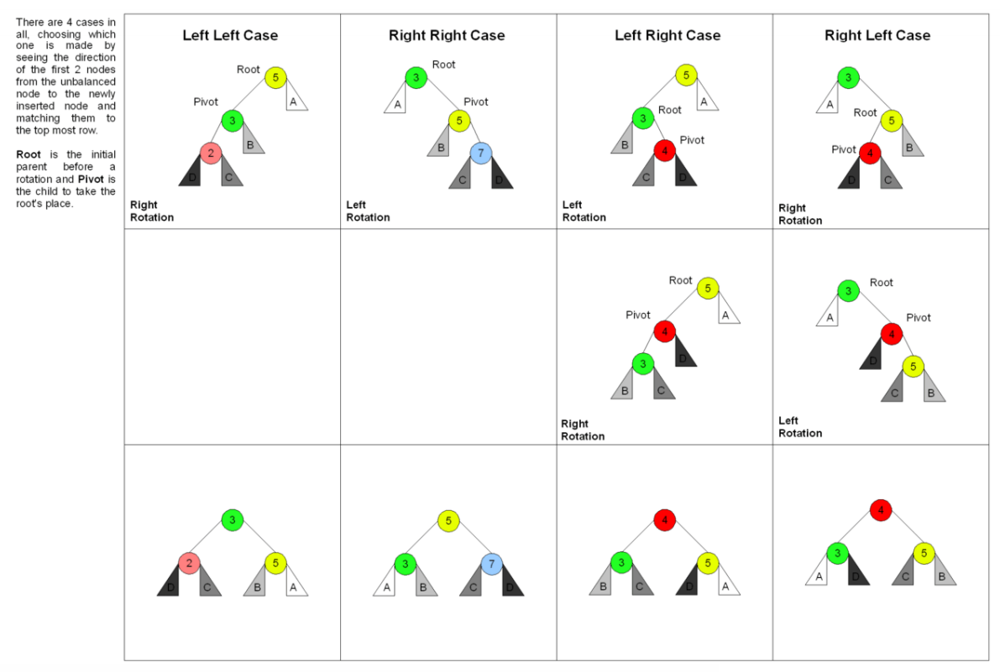


### AVL 总结

1.平衡二叉搜索树 

2.每个结点存 balance factor = {-1, 0, 1} 

3.四种旋转操作 

不足：结点需要存储额外信息、且调整次数频繁


## 红黑树 Red-black Tree

### 定义

红黑树是一种近似平衡的二叉搜索树（Binary Search Tree），它能够确保任何一 个结点的左右子树的高度差小于两倍。具体来说，红黑树是满足如下条件的二叉 搜索树： 

• 每个结点要么是红色，要么是黑色 

• 根结点是黑色 • 每个叶结点（NIL结点，空结点）是黑色的

• 不能有相邻接的两个红色结点 

• 从任一结点到其每个叶子的所有路径都包含相同数目的黑色结点

### 关键性质

从根到叶子的最长的可能路径不多于最短的可能路径的两倍长。

### 对比

• AVL trees providefaster lookups than Red Black Trees because they are more strictly balanced. 

• Red Black Trees providefaster insertion and removal operations than AVL trees as fewer rotations are done due to relatively relaxed balancing. 

• AVL trees storebalance factors or heightswith each node, thus requires storage for an integer per node whereas Red Black Tree requires only 1 bit of information per node. 

• Red Black Trees are used in most of the language libraries likemap, multimap, multisetin C++whereas AVL trees are used indatabaseswhere faster retrievals are required.

